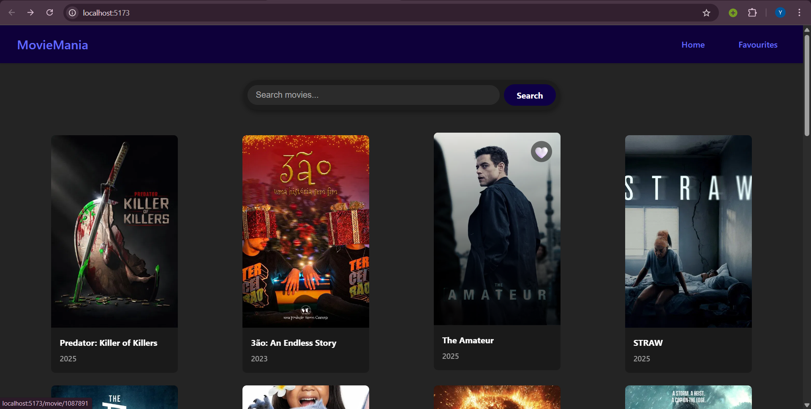

# 🎬 MovieMania

**MovieMania** is a modern and visually stylish movie discovery web app built with **React.js** and powered by the **TMDB API**. Explore the latest trending movies, view detailed information including cast, crew, and reviews, and manage your list of favourites — all in one place.

---

## 🌟 Features

- 🔍 Browse and search for popular movies
- 🖼️ Clean grid layout showing posters, title & release year
- 🎬 Click a movie card to open a **detailed info page** including:
  - Overview & release info
  - IMDb rating
  - Cast, director, and writers
  - Reviews (if available)
- ❤️ Add/remove movies to your Favourites
- 🌈 Stylish background gradients and responsive UI
- 💨 Fast SPA experience using React Router & Context API

---

## 📸 Screenshots

### 🏠 Home Page  



### 🎥 Movie Detail Page  


> *(Replace the above image URLs with your own uploaded image links or GitHub paths)*

---

## 🛠️ Tech Stack

- **React.js** — Frontend Framework  
- **React Router** — SPA routing  
- **TMDB API** — Source of movie data  
- **Context API** — Global state management (for favourites)  
- **CSS3** — Custom styling  
- **Vite** — Lightning-fast dev server and build tool


---

## ⚙️ Getting Started

### 🧾 Prerequisites

- Node.js (v16 or above)
- npm or yarn

### 🚀 Installation

```bash
git clone https://github.com/Yash-Kunal/movie-mania.git
cd movie-mania
npm install
npm run dev


