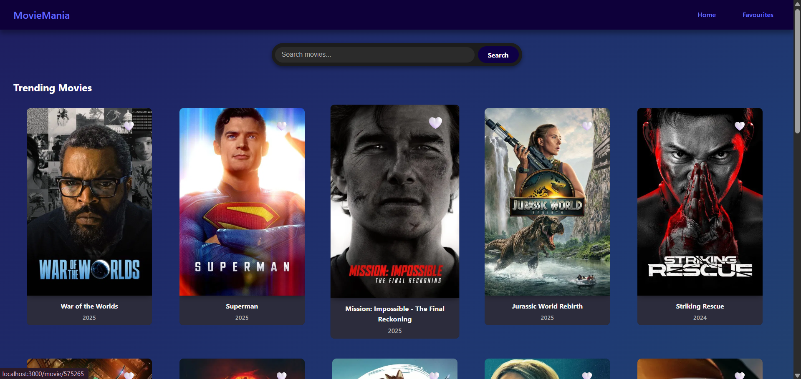
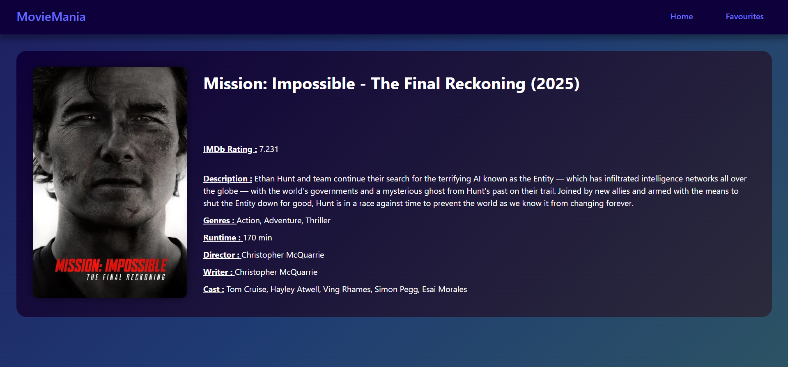
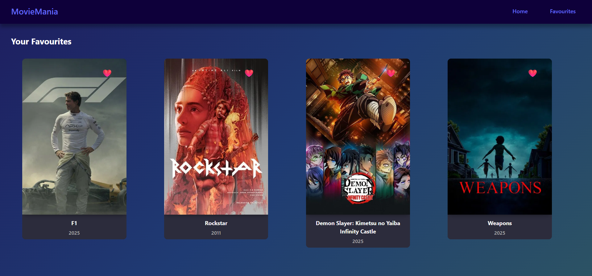

# 🎬 MovieMania – A Movie Discovery Web App

MovieMania is a sleek and interactive web app that lets users browse, search, and explore movies using **The Movie Database (TMDB) API**. Users can view detailed information about movies, including cast, crew, reviews, and ratings, while also saving their favourites for easy access.  

---

## ✨ Features
- 🔍 Browse and search for popular movies  
- 🖼️ Clean grid layout showing posters, title & release year  
- 🎬 Click a movie card to open a **detailed info page** including:  
  - Overview & release info  
  - IMDb rating  
  - Cast, director, and writers  
  - Reviews (if available)  
- ❤️ Add/remove movies to your Favourites  
- 🔄 **Infinite Scrolling** to load more movies as you scroll  
- 🌈 Stylish background gradients and responsive UI  
- 💨 Fast SPA experience using React Router & Context API  

---

## 🛠️ Tech Stack
- **Frontend:** React.js, JavaScript, CSS 
- **State Management:** React Context API  
- **API:** [TMDB API](https://www.themoviedb.org/documentation/api)  
- **Build & Deployment:** Vite, Docker, Nginx  

---

## 📸 Screenshots  

### 🏠 Home Page  
  

### 🎬 Movie Detail Page  
  

### ❤️ Favourites Page  
  

---

## 🚀 Getting Started

### 1️⃣ Clone the repo
```bash
git clone https://github.com/Yash-Kunal/movie-mania.git
cd movie-mania
